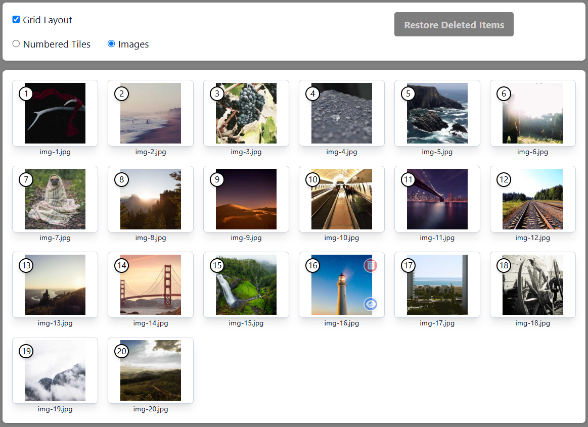

# jquery-sortable-demo

This repository contains a working demonstration of:

* jQuery UI Sortable Widget - <https://api.jqueryui.com/sortable/>
* TailwindCSS - <https://tailwindcss.com/>
* AlpineJS - <https://alpinejs.dev/>
* HTML <template> - 
  * <https://developer.mozilla.org/en-US/docs/Web/HTML/Element/template>
  * <https://www.w3schools.com/tags/tag_template.asp>

It takes the form of a grid or column of image thumbnails where you can - 

* Arrange the order 
* View as a grid or column
* Delete & recover thumbnails

  

    <figure>
        
         
        <figcaption><strong>Grid Layout - Tile Images</strong></figcaption>
    </figure>

  

    <figure>
        
         
        <figcaption><strong>Grid Layout - Picsum Images</strong></figcaption>
    </figure>

  

    <figure>
        
         
        <figcaption><strong>Column Layout - Picsum Images</strong></figcaption>
    </figure>

  

    <figure>
        
         
        <figcaption><strong>Column Layout - Indicators & Controls</strong></figcaption>
    </figure>

  

## Running The Demonstration

After obtaining a copy of the files in this repository you only need to open `sortable.html` in any *desktop* browser. 

Then you can grab any of the thumbnails *one at a time* with you mouse and move them to a new position. Once moved the position numbers are updated to give you an indication of the order.

You can also delete any of the thumbnails and restore them by either clicking "Restore Deleted Items" *or* by changing to "Numbered Tiles" or "Images".

**NOTE:** This repo does not contain any images from <a href="https://picsum.photos/" target="_blank">Picsum</a>. To obtain them go to the `assets/img` folder and run the `grabimg.sh` script. It uses `curl` to dowwload 20 300x300 pixel images.

